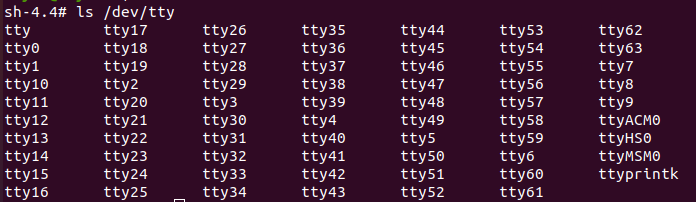
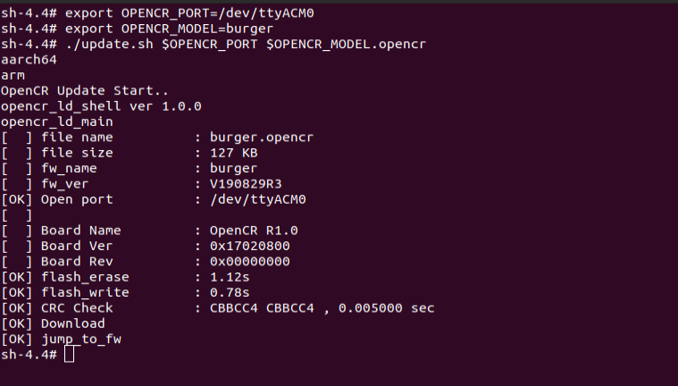

# Behaviour cloning on Qualcomm RB5 

## Introduction
The goal of this project is to demonstrate real-time behavior cloning between two TurtleBot3 Burgers using the Qualcomm Robotics Platform RB5, utilizing the power of ROS2-Dashing. Real-time behavior cloning refers to the process of cloning the behavior of one TurtleBot3 Burger and transfer it to another TurtleBot3 Burger, enabling the second robot to mimic the actions and movements of the first robot in real-time utilizing the same network and subscription topic of the robot. 

## Prerequisites 
- A Linux host system with Ubuntu 18.04. 
- Install Android Platform tools (ADB, Fastboot)   
- Install SSH on host and device for secure shell communication 
- Download and install the SDK Manager for RB5 
- Flash the RB5 firmware image on to the RB5 
- Setup the Network on RB5. 
- Installed python3.6  
- Two or more TurtleBot3 burger robots 

##   Installing Dependencies 
### Installation of turtlebot packages on both RB5 platform connected to TurtbleBot3 burger robots  
 
1. Installing necessary packages  
```sh
$ sudo apt install python3-argcomplete python3-colcon-common-extensions libboost-system-dev build-essential git  
```

2. Create new directory for TurtleBot 3  
```sh
$ mkdir -p ~/turtlebot3_ws/src && cd ~/turtlebot3_ws/src  
```
3. Cloning necessary repositories  
```sh
$ git clone -b dashing-devel https://github.com/ROBOTIS-GIT/hls_lfcd_lds_driver.git  
$ git clone -b dashing-devel https://github.com/ROBOTIS-GIT/turtlebot3_msgs.git 
$ git clone -b dashing-devel https://github.com/ROBOTIS-GIT/turtlebot3.git 
$ git clone -b dashing-devel https://github.com/ROBOTIS-GIT/DynamixelSDK.git  
```
4. Removing unnecessary folders  
```sh
$ cd ~/turtlebot3_ws/src/turtlebot3 
$ rm -r turtlebot3_cartographer turtlebot3_navigation2  
$ cd ~/turtlebot3_ws/  
```
5. Sourcing the TurtleBot3 Setup file 
```sh
$ source /opt/ros/dashing/setup.bash  
```
6. Building TurtleBOT packages 
```sh
$ colcon build 
```
7. Set the ROS environment  
```sh
$ echo 'source ~/turtlebot3_ws/install/setup. Bash' >> ~/.bashrc 
$ echo 'export ROS_DOMAIN_ID=30 #TURTLEBOT3' >> ~/.bashrc 
$ source ~/.bashrc 
```


### Steps to flash ROS2 firmware into OpenCR setup on both Turtlebot3 

1. The Default firmware supports ROS 1 as ROS Dashing is a ROS 2 version, we need to upgrade OpenCR firmware  
2. Create a temp folder for Binaries 
```sh
$ mkdir /home/opencrbin/ && cd /home/opencrbin 
```
3. Download the latest binaries & unzip 
```sh
$ wget https://github.com/ROBOTIS-GIT/OpenCR-Binaries/raw/master/turtlebot3/ROS2/latest/opencr_update.tar.bz2 tar -xjf ./opencr_update.tar.bz2  
```
4. Setting the OpenCR port & TurtleBot Model 
5. Before flashing the firmware, please check if ttyACM0 port exists 


6. Now execute following command: 
```sh
$ export OPENCR_PORT=/dev/ttyACM0 
$ export OPENCR_MODEL=burger 
```
7. Uploading the latest firmware 
```sh
$ cd /home/opencrbin/opencr_update && ./update.sh $OPENCR_PORT $OPENCR_MODEL.opencr 
```

 

### ROS2 Communication 
 In ROS2, nodes communicate with each other using a default protocol called the Data Distribution Service (DDS). It is a standardized protocol for real-time, scalable, and reliable data exchange in distributed systems. DDS employs a discovery mechanism that allows nodes to automatically discover each other which relias under same domain id. 

 Here are the key features of the DDS communication protocol in ROS2: 

- Publisher-Subscriber Model: Nodes in ROS2 follow a publisher-subscriber model, where publishers sends messages (data) on specific topics(named channels or communication channels), and subscribers receive those messages from the topics they are interested in.  

- DDS: 
1. Discovery: DDS employs a discovery mechanism that allows nodes to automatically discover each other  without requiring explicit configuration. Nodes register with the DDS middleware, and the middleware propagates information about publishers, subscribers, and topics to interested parties, enabling dynamic and decentralized communication. 

2. Quality of Service (QoS): DDS provides a rich set of Quality of Service settings that allow us to tune communication between nodes.  

3. Reliable and Scalable: DDS provides built-in mechanisms for reliable and scalable data exchange. It supports data-centric publish-subscribe communication, efficient message serializatio         n/deserialization, and efficient multicast-based distribution to multiple subscribers. 

4. Security: ROS2 with DDS supports various security features, including authentication, encryption, and access control, to ensure secure communication between nodes in distributed systems. 

5. Extensibility: The DDS protocol is designed to be extensible, allowing for the integration of custom middleware and the addition of custom features as needed. 


### Test behaviour cloning 

- Follow below on TurtleBot-A 

1. In host system terminal one, enter RB5 shell of TurtleBot-A by running below command 
```sh
$ ssh root@<IP_ADDRESS_OF_BOT-A> 
```
2. Source the workspace and launch the bring up command 
```sh
sh4.4 export ROS_DOMAIN_ID=30 
sh4.4 export TURTLEBOT3_MODEL=burger 
sh4.4 source /opt/ros/dashing/setup.bash 
```
3. Run bring up command 
```sh
sh4.4 ros2 launch turtlebot3_bringup robot.launch.py 
```
 
- Follow below on Turtlebot-B 
1. Run the same set of command as ran on TurtleBot3-A
Now both robots A and B will be up and running and will be sharing the same Domain ID.  

- Run the below command on TurtleBot3-A: 
```sh
sh4.4 rostopic pub /cmd_vel geometry_msgs/Twist '{linear:  {x: 0.1, y: 1.0, z: 1.0}, angular: {x: 0.0,y: 0.0,z: 0.0}}' 
```
Now both robots will share same sensor data to execute the same actions based on the received commands. 
You can run any of the real-time application to perform real-time behavioural cloning on  both robots 


